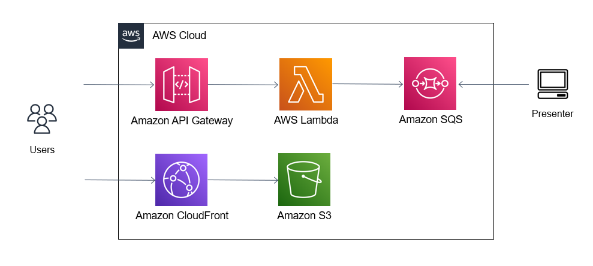

# Marquee Comments Viewer
Display marqueeing comments on your desktop


## Installation
You need to install `aws-cdk` and `npm` to execute following commands.
If you haven't configured aws profiles, you also need to install `aws-cli` and set up your aws credential profiles.
```bash
cd ./marquee-comments-viewer/web
npm install
npm run build
cd ./marquee-comments-viewer/infra
cdk deploy
```


## Architecture



## License
MIT License

